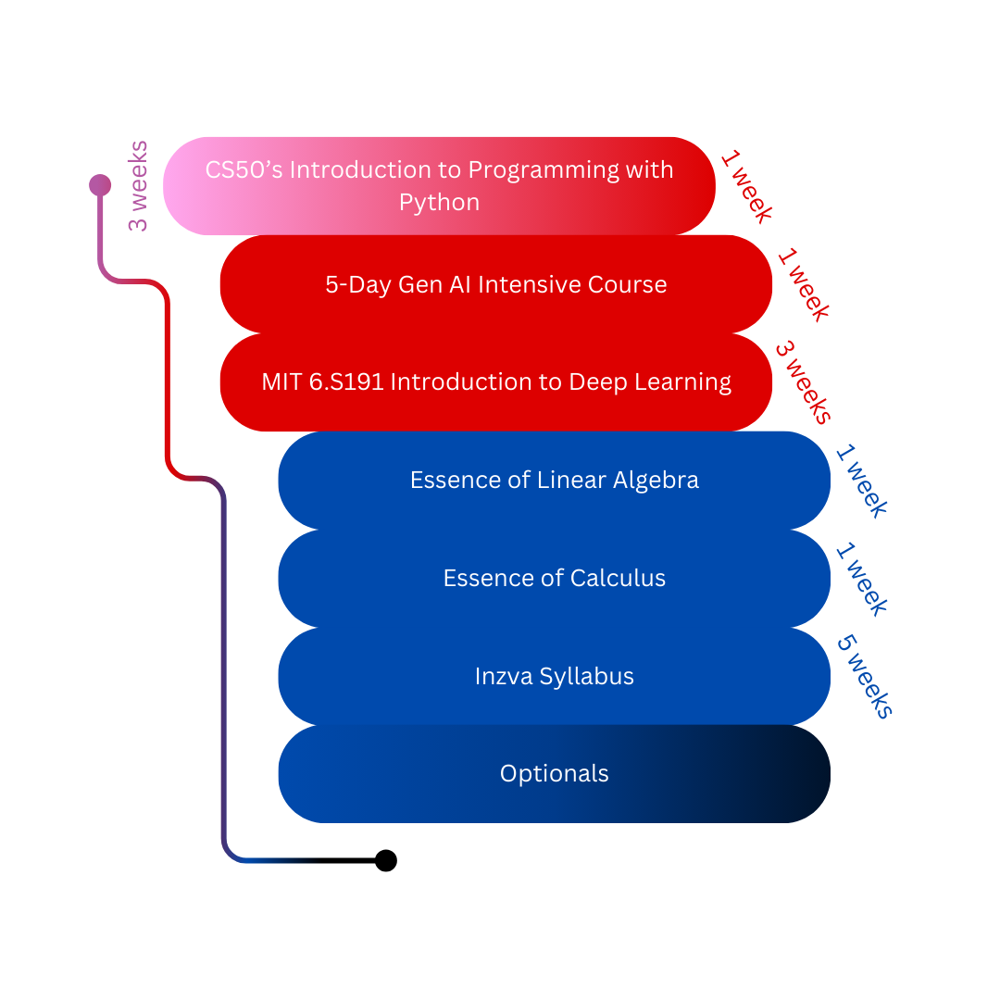

# YZT Curricula

Welcome to the YZT Curricula! YZT values your time and learning motivation. For encouraging your studies and eliminating frictions, we form various curricula to enhance your learning experience.

_The deadlines are based on our starting date, January 27, 2025._

## Introduction

Although this document is oriented for Middle East Technical University (METU) undergrads, it is not exclusive. **This resource is for anyone would love to learn.**

**Biggest prerequisite for us:** Besides from the essential math knowledge; having enthusiasm, and courage to carry on are crucial. If you have these two, you are a great candidate. Your department, age, or school does not matter.

### What Will We Do?

Every curriculum has its own deadlines and tasks. 
By the end of February 16, theı end of the semester holiday, different learning groups will finalize the [Python Course](cs50.harvard.edu/python) and the [Gen AI Intensive Course.](https://www.kaggle.com/learn-guide/5-day-genai) The following content shows what will be covered by the first half of 2024–2025 spring semester.

## Programming Fundamentals Track (Pink)

This track has one goal, teaching you the programming essentials. Whether you will be a philosopher, an artist, or an FBI agent; you **must** learn algorithmic thinking.

Be mindful for the _duration_ and _effort_ columns. They are merely estimate and vary for each person.

| Course Name | Duration | Effort | Prerequisites | Our Deadline |
|-------------|----------|--------|---------------|--------------|
| [CS50’s Introduction to Programming with Python](https://cs50.harvard.edu/python) | 10 weeks | 3-9 hours per week | high school math | 3 weeks, until February 16 |
| [(Optional) MITx: Introduction to Computer Science and Programming Using Python](https://www.edx.org/learn/computer-science/massachusetts-institute-of-technology-introduction-to-computer-science-and-programming-using-python) | 9 Weeks | 14-16 hours per week | high school math | - |

### Who Should Take the Programming Fundamentals Track?

If you participated some of our face-to-face lessons and/or the Python Course throughout the 2024–2025 fall semester, you are encouraged to finalize the Python Course. You will have a firm understanding and sufficient practice if you are going to take CENG240 in the spring semester.

## Deep Learning Track (Red)

Technical Team (TT) has two distinct groups; _Learning,_ and _Project._ Learning Group consists of members who are willing to devote more time to specialize on various areas such as machine learning, deep learning, generative AI, or computer vision. If you are a TT member or a TT candidate, you must join our Slack to participate while learning.

| Course Name | Duration | Effort | Prerequisites | Our Deadline |
|-------------|----------|--------|---------------|--------------|
| [CS50’s Introduction to Programming with Python](https://cs50.harvard.edu/python) | 10 weeks | 3-9 hours per week | high school math | 1 week, until February 2 |
| [5-Day Gen AI Intensive Course](https://www.kaggle.com/learn-guide/5-day-genai) | 5 days | 4-6 hours per day | [CS50’s Introduction to Programming with Python](https://cs50.harvard.edu/python) or equivalent experience | 1 week, until February 9 |
| [MIT 6.S191 Introduction to Deep Learning](https://introtodeeplearning.com/) (you can find the lecture videos from its youtube channel if 2025 versions are not uploaded yet) | 3 weeks | 2 lectures and 1 software lab per week | [CS50’s Introduction to Programming with Python](https://cs50.harvard.edu/python) or equivalent experience | 3 weeks, until March 2 |

### Who Should Take the Deep Learning Track?
If you are in our TT Learning Group, you must follow this track. You will be able to start AI projects and join the TT Project Group from the halfway point onward.

## Math Track

This track requires rigorous prerequisites. Thus, the curriculum consists various courses to scaffold your math skills. You don't have to finish all the math courses, but Inzva Syllabus assumes you have the essentials. If you are a METU engineering undergrad, you may skip _Essence of Linear Algebra_ and _Essence of Calculus_ courses.

| Course Name | Duration | Effort | Prerequisites | Our Deadline |
|-------------|----------|--------|---------------|--------------|
| [Essence of Linear Algebra](https://www.youtube.com/playlist?list=PLZHQObOWTQDPD3MizzM2xVFitgF8hE_ab) | 1 week | - | high school math | 1 week, until February 9 |
| [Essence of Calculus](https://www.youtube.com/playlist?list=PLZHQObOWTQDMsr9K-rj53DwVRMYO3t5Yr) | 1 week | - | high school math | 1 week, until February 16 |
| (This part is equivalent to _most_ parts of METU's MATH119 course) [Calculus 1A: Differentiation](https://mitxonline.mit.edu/courses/course-v1:MITxT+18.01.1x/), [Calculus 1B: Integration](https://mitxonline.mit.edu/courses/course-v1:MITxT+18.01.2x/), and [Calculus 1C: Coordinate Systems & Infinite Series](https://mitxonline.mit.edu/courses/course-v1:MITxT+18.01.3x/) | 14 weeks | 4-6 hours per week | high school math | 5 weeks, until March 2 |
| (This part is equivalent to _some_ parts of METU's MATH120 course) [Multivariable Calculus 1: Vectors and Derivatives](https://mitxonline.mit.edu/courses/course-v1:MITxT+18.02.1x/), and [Multivariable Calculus 2: Integrals](https://mitxonline.mit.edu/courses/course-v1:MITxT+18.02.2x/) | 14 weeks | 4-6 hours per week | [Calculus 1C: Coordinate Systems & Infinite Series](https://mitxonline.mit.edu/courses/course-v1:MITxT+18.01.3x/) | 3 weeks, until March 23 |
| [Linear Algebra](https://ocw.mit.edu/courses/18-06sc-linear-algebra-fall-2011/) | 150 hours | - | [Essence of Linear Algebra](https://www.youtube.com/playlist?list=PLZHQObOWTQDPD3MizzM2xVFitgF8hE_ab) | - |
| [Mathematics for Computer Science](https://openlearninglibrary.mit.edu/courses/course-v1:OCW+6.042J+2T2019/about) | 13 weeks | - | [Calculus 1C: Coordinate Systems & Infinite Series](https://mitxonline.mit.edu/courses/course-v1:MITxT+18.01.3x/) | - |
| [Probabilistic Systems Analysis and Applied Probability](https://ocw.mit.edu/courses/6-041sc-probabilistic-systems-analysis-and-applied-probability-fall-2013/) | 14 weeks | 11-12 hours per week |[Multivariable Calculus 2: Integrals](https://mitxonline.mit.edu/courses/course-v1:MITxT+18.02.2x/) | - |

### Who Should Take the Math Track?

If you are at Specialties part, you may take Math Track and a specialty course simultaneously. Math Track helps you to get the necessary mathematical knowledge for Inzva Syllabus and beyond. The track is not sacred, but it is recommended if you consider a career in AI field.

### Specialties

If you finish Deep Learning track, you may take at least one specialty course to deepen your deep learning knowledge.

| Course Name | Duration | Effort | Prerequisites | Our Deadline |
|-------------|----------|--------|---------------|--------------|
| [Inzva Syllabus](https://github.com/inzva/inzva-DLSG) | 11 weeks | 10 hours per week | [CS50’s Introduction to Programming with Python](https://cs50.harvard.edu/python), [Essence of Linear Algebra](https://www.youtube.com/playlist?list=PLZHQObOWTQDPD3MizzM2xVFitgF8hE_ab), [Essence of Calculus](https://www.youtube.com/playlist?list=PLZHQObOWTQDMsr9K-rj53DwVRMYO3t5Yr) | 5 weeks, until April 6 |
| Yann LeCun’s Deep Learning Course [course](https://atcold.github.io/NYU-DLSP21/), [videos](https://youtube.com/playlist?list=PLgF7i4LH-YxacgG0OPmTYe1UUQAvcw9Ke&si=KpVCvJUkU8i1AEaf) | 15 weeks | - | [CS50’s Introduction to Programming with Python](https://cs50.harvard.edu/python), [Essence of Linear Algebra](https://www.youtube.com/playlist?list=PLZHQObOWTQDPD3MizzM2xVFitgF8hE_ab), [Essence of Calculus](https://www.youtube.com/playlist?list=PLZHQObOWTQDMsr9K-rj53DwVRMYO3t5Yr) | - |
